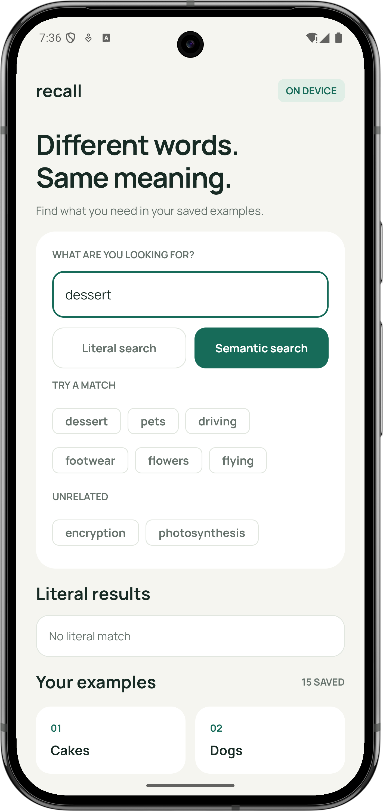
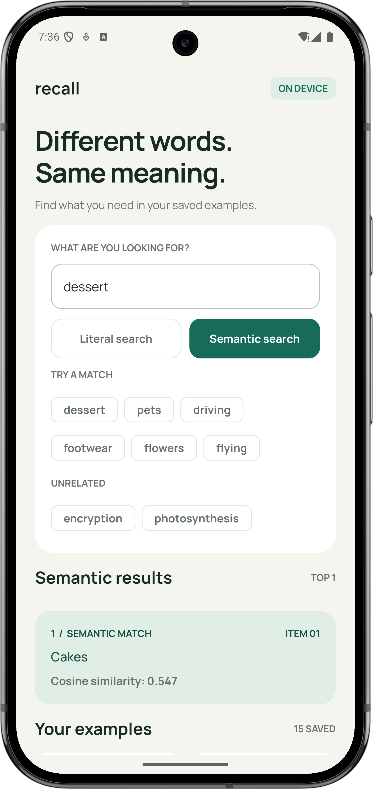

# Build Semantic Search on Android with EmbeddingGemma

This is the source code for Episode 3 of the On Device RAG on Android course.

The app shows how Android can find related text even when the query uses different words. It also shows the most important limitation of semantic search:

> The closest result is only the closest result. It is not automatically the right result.

| Literal search | Semantic search |
| --- | --- |
|  |  |

## Table of contents

1. [What the app demonstrates](#what-the-app-demonstrates)
2. [Search by words and search by meaning](#search-by-words-and-search-by-meaning)
3. [How semantic search works](#how-semantic-search-works)
4. [Why the closest result can be wrong](#why-the-closest-result-can-be-wrong)
5. [Reject weak matches](#reject-weak-matches)
6. [Try the demo](#try-the-demo)
7. [Understand Top K](#understand-top-k)
8. [Understand the Android implementation](#understand-the-android-implementation)
9. [Set up the project](#set-up-the-project)
10. [Read the code](#read-the-code)
11. [Use Logcat](#use-logcat)
12. [References](#references)

## What the app demonstrates

The app searches a small in-memory list of 15 words.

Search for `dessert` with **Literal search**. The word `dessert` does not exist in the list, so it returns nothing. Run the same query with **Semantic search** and it returns `Cakes` because the two words are related.

That result looks intelligent. Now search for `encryption`. Nothing in the list is a useful answer, but semantic search still has a nearest item. With the threshold disabled, it returns that item even though the match is weak.

Both searches use the same model, cosine similarity calculation, ranking, and Top K logic.

## Search by words and search by meaning

The app shows two intentionally small search methods.

### Literal phrase search

Literal search checks whether an item contains the query text. It works well when the same word is present.

`Cakes` finds `Cakes`.

`dessert` does not find `Cakes` because the words are different.

This is a basic substring comparison created for the lesson. Production lexical search can also use tokenization, stemming, synonyms, BM25, and other techniques.

### Semantic search

Semantic search compares numerical representations of the query and the stored items. Related text tends to have similar representations, even when the words are different.

`dessert` can therefore find `Cakes`.

This does not mean the model understands text like a person. An embedding is a learned numerical representation, not meaning itself.

## How semantic search works

EmbeddingGemma converts each text value into a vector containing 768 numbers. All vectors are produced by the same model and live in a compatible vector space.

The app follows this flow:

```text
QUERY
  ↓
QUERY EMBEDDING
  ↓
COMPARE WITH EVERY DOCUMENT EMBEDDING
  ↓
COSINE SIMILARITY SCORES
  ↓
SORT FROM HIGHEST TO LOWEST
  ↓
TAKE TOP K
  ↓
APPLY THE SIMILARITY THRESHOLD
  ↓
RESULTS
```

### Prepare document embeddings

The app creates the 15 document embeddings once during initialization and keeps them in memory.

It does not recreate those vectors for every search. In a real application, document embeddings are normally created while indexing the content and persisted for later use.

### Create the query embedding

Every search creates a new embedding for the current query.

EmbeddingGemma uses different retrieval roles for queries and documents:

- Queries use `RETRIEVAL_QUERY`.
- Documents use `RETRIEVAL_DOCUMENT` and include a title.

The same model produces both vectors, but the role tells it whether the input is a search query or searchable content. The Text Embedder SDK applies the required EmbeddingGemma formatting.

### Calculate cosine similarity

Cosine similarity compares the direction of two vectors.

```text
cosine similarity = dot product / (length of A × length of B)
```

The result ranges from `-1` to `1`:

- A higher value means the vectors are more similar.
- A lower value means the vectors are less similar.
- The value is not a confidence percentage.
- The value does not prove that the result is correct.

The app displays this score beside every semantic result.

### Rank the results

The app calculates a score for every stored item, sorts the scores from highest to lowest, and returns the nearest items first.

Ranking answers this question:

> Which items are closest to the query?

Ranking does not answer this question:

> Does any item actually answer the query?

## Why the closest result can be wrong

A finite list always has a closest item.

Imagine that the list contains only Cakes, Dogs, Cars, Sofas, and Shoes. If you search for `encryption`, one of those items still receives the highest score. It wins the ranking, but that does not make it relevant.

In this 15-item example, `encryption` and `photosynthesis` produce weak matches. Those matches are still the nearest items in this particular list.

This is why semantic search can look impressive for `dessert → Cakes` and still return a wrong result for `encryption`.

## Reject weak matches

The first mitigation is a similarity threshold.

After ranking the results, the app keeps only results whose score reaches the selected minimum:

```text
score >= threshold  →  return the result
score < threshold   →  reject the result
```

Set the threshold above the weak score for `encryption`, then search again. The app returns **No relevant result**.

A threshold reduces obvious weak matches. It does not guarantee correctness. The right value depends on the model, corpus, domain, and real query distribution. Measure it with representative data instead of copying a number from this demo.

## Try the demo

Start with Top K set to `1` and minimum similarity set to `-1`. A threshold of `-1` accepts the full cosine range, so the app always returns the nearest item.

Try these successful searches:

| Query | Expected first result | What it demonstrates |
| --- | --- | --- |
| `dessert` | Cakes | Related words can match |
| `pets` | Dogs | A category can find an example |
| `driving` | Cars | An activity can find a related object |
| `footwear` | Shoes | A broader term can find a specific item |
| `flowers` | Roses | A category can find a member |
| `flying` | Airplanes | An action can find a related object |

Now try the unrelated searches:

| Query | What to watch |
| --- | --- |
| `encryption` | The engine still returns its nearest item when the threshold is disabled |
| `photosynthesis` | The engine again ranks an unrelated item first |

Raise the minimum similarity above the displayed score and search again. The weak result is rejected.

The exact scores and lower-ranked items can vary with the model bundle and app configuration. Use the values shown on your device when presenting the demo.

## Understand Top K

Top K controls how many ranked results the app keeps.

- Top K `1` keeps the closest result.
- Top K `3` keeps the three closest results.
- **All results** keeps every ranked result.

Top K answers how many candidates to return. It does not decide whether those candidates are good enough. The similarity threshold handles that separate decision.

Retrieval Top K is also different from generation Top K:

- Retrieval Top K controls how many search results are kept.
- Generation Top K controls which token candidates a language model considers while generating text.

This app performs retrieval only. It does not generate text.

## Understand the Android implementation

The project uses Kotlin, Jetpack Compose, coroutines, and a small MVVM structure.

```text
MainActivity
    ↓
SearchScreen
    ↓
SearchViewModel
    ↓
SemanticSearchEngine
    ↓
EmbeddingGemmaEngine
    ↓
MediaPipe Text Embedder and LiteRT
```

### Model

`SearchDocument` and `SearchResult` are the only data classes. The corpus is a hardcoded Kotlin list.

### ViewModel

`SearchViewModel` initializes the engine, exposes `SearchUiState`, starts searches, and sends results to the screen.

`viewModelScope` owns the coroutines. EmbeddingGemma work runs on one background thread because `TextEmbedder.embed()` is synchronous and must not block the Android main thread. Keeping model calls on one thread also makes initialization, inference, and cleanup happen in order.

### View

`SearchScreen` displays the query field, separate literal and semantic search buttons, results, cosine scores, corpus, Top K, and threshold controls.

### Search engine

`SemanticSearchEngine` contains the complete retrieval flow:

1. Prepare document embeddings.
2. Create a query embedding.
3. Calculate cosine similarity for every item.
4. Sort results by similarity.
5. Take Top K.
6. Apply the threshold.
7. Return the accepted results.

### Embedding runtime

`EmbeddingGemmaEngine` contains only the low-level model setup and embedding calls. This keeps LiteRT and Text Embedder details out of the search algorithm.

The app uses the LiteRT-backed MediaPipe Text Embedder through `com.google.mediapipe:tasks-text:1.0.0`.

## Set up the project

Open `semantic-search-android` directly in Android Studio.

You need:

- An Android Studio version that supports Android Gradle Plugin 9.4
- JDK 17 or newer
- Android SDK 37
- An Android device running Android 8.0 or newer

The project is standalone. You do not need any previous episode.

### Download EmbeddingGemma

Run this command from `semantic-search-android`:

```sh
curl --fail --location \
  'https://storage.googleapis.com/mediapipe-models/text_embedder/embedding_gemma/int4int8/latest/embedding_gemma.task' \
  --output app/src/main/assets/embedding_gemma.task
```

The model bundle is about 175 MB and is excluded from Git. Skip the download if `app/src/main/assets/embedding_gemma.task` already exists.

Use the `.task` bundle from the official guide. A raw `.tflite` or `.litertlm` file is not interchangeable with this asset. Review the [Gemma terms](https://ai.google.dev/gemma/terms) before using or distributing the model.

The app has no Internet permission. After the model is bundled into the app, inference runs offline.

### Build the app

```sh
./gradlew :app:assembleDebug
```

### Run lint

```sh
./gradlew :app:lintDebug
```

## Read the code

Read these files in order:

1. [`SearchDocument.kt`](semantic-search-android/app/src/main/java/dev/belalkhan/semanticsearch/model/SearchDocument.kt) contains the searchable items.
2. [`SemanticSearchEngine.kt`](semantic-search-android/app/src/main/java/dev/belalkhan/semanticsearch/search/SemanticSearchEngine.kt) shows the full search algorithm.
3. [`EmbeddingGemmaEngine.kt`](semantic-search-android/app/src/main/java/dev/belalkhan/semanticsearch/search/EmbeddingGemmaEngine.kt) shows the query and document retrieval roles.
4. [`SearchViewModel.kt`](semantic-search-android/app/src/main/java/dev/belalkhan/semanticsearch/ui/SearchViewModel.kt) runs model work and updates the UI state.
5. [`SearchScreen.kt`](semantic-search-android/app/src/main/java/dev/belalkhan/semanticsearch/ui/SearchScreen.kt) displays the demo.

The remaining files contain small models, UI state, theme setup, and the activity entry point.

## Use Logcat

Filter Logcat by `SemanticSearch`:

```sh
adb logcat -s SemanticSearch
```

The logs show:

- Document embedding preparation
- Document embedding reuse
- Query embedding latency
- Every candidate score
- The complete ranking
- Top K
- Threshold rejection

Use the UI for the lesson and Logcat when you want to inspect the full retrieval process.
